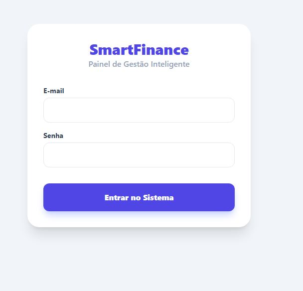
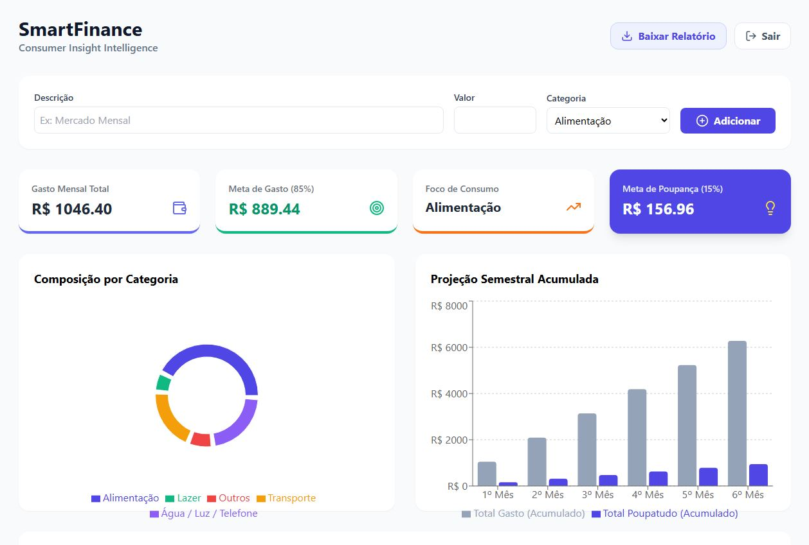
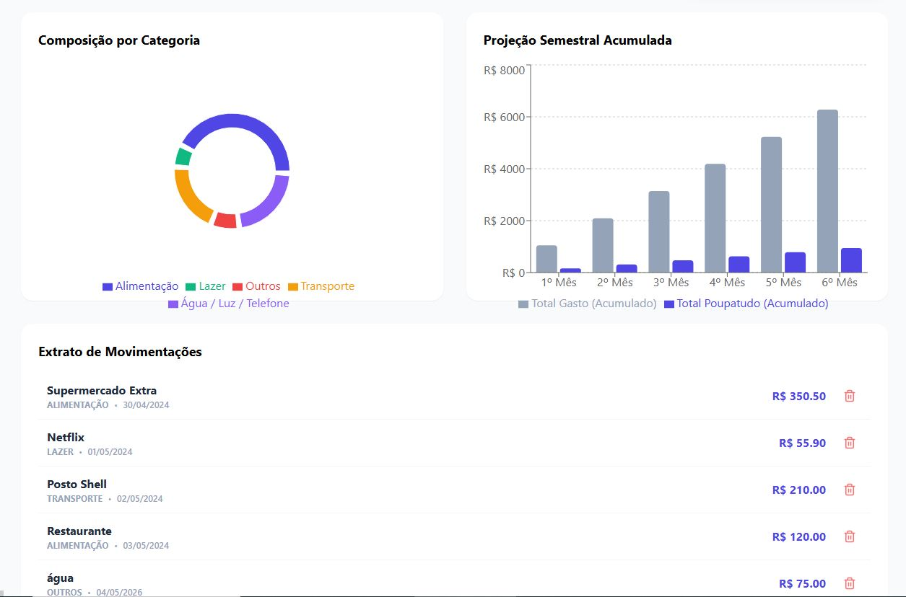
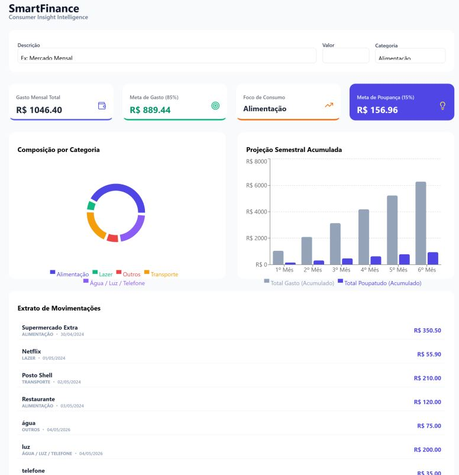

# Consuma+ | Consumer Insight Intelligence

O **SmartFinance** é uma plataforma de inteligência financeira desenvolvida para transformar a gestão de gastos pessoais em uma experiência analítica e estratégica. O projeto foca em converter dados brutos de transações em insights acionáveis, auxiliando usuários a identificar padrões de consumo e estabelecer metas de economia inteligentes.

## 📸 Demonstração do Sistema

### Tela de Login


*Interface de acesso segura integrada com Context API para gerenciamento de sessão.*

### Dashboard Principal

*Painel com saldo de gastos, identificação de foco de consumo e gráfico de metas inteligentes.*

### Histórico e Composição de Gastos

*Visualização detalhada do histórico de transações e gráfico de pizza por categoria.*

### Relatório em PDF

*Relatório em PDF.*
---
## 🚀 Sobre o Projeto

O SmartFinance não é apenas um dashboard de visualização; é um ecossistema de Business Intelligence desenhado para oferecer clareza e previsibilidade financeira através de uma interface intuitiva e robusta.

### 🛠️ Tecnologias Utilizadas

*   **Frontend**: React.js com TypeScript.
*   **Ferramenta de Build**: Vite (garantindo alta performance no desenvolvimento).
*   **Estilização**: Tailwind CSS para um design moderno e responsivo.
*   **Visualização de Dados**: Recharts para criação de gráficos de composição (Pizza) e projeções (Barras).
*   **Exportação de Dados**: html2canvas e jsPDF para geração de relatórios em PDF.
*   **Ícones**: Lucide React.
*   **Backend & Persistência**: Sistema híbrido com JSON Server (API REST) e LocalStorage (Navegador).
*   **Gestão de Estado**: Context API para gerenciamento de autenticação global.

## 📊 Funcionalidades Principais

*   **Persistência Híbrida**: O sistema detecta automaticamente o ambiente. Prioriza o JSON Server localmente, mas utiliza o **LocalStorage** para manter os dados no navegador caso o servidor esteja offline ou o projeto esteja hospedado no Vercel.
*   **Relatórios em PDF**: Exportação instantânea do dashboard completo (gráficos e histórico) para arquivos PDF, facilitando o compartilhamento da análise financeira.
*   **Dashboard Inteligente**: Painel visual com saldo total de gastos e identificação do foco principal de consumo.
*   **Metas de Economia**: Algoritmo que projeta cenários de economia (15%) baseados no comportamento financeiro atual.
*   **Projeção Semestral**: Algoritmo que projeta o acúmulo de capital para os próximos meses, permitindo o planejamento de grandes compras ou investimentos.
*   **Gestão de Transações**: Sistema para controle rigoroso de despesas com geração de IDs únicos via UUID.

## 🛠️ Configuração do Ambiente

### Pré-requisitos
*   Node.js instalado.
*   Gerenciador de pacotes (npm ou yarn).

### Passo a Passo

1.  **Clone o repositório**:
    ```bash
    git clone [https://github.com/Li-code1/smart-finance.git](https://github.com/Li-code1/smart-finance.git)
    ```

2.  **Instale as dependências**:
    ```bash
    npm install
    
```

3.  **Inicie o Backend (Opcional)**:
    Para utilizar a persistência via API local, execute em um terminal:
    ```bash
    npm run server
    
```
    *Nota: Se o servidor não estiver rodando, o sistema utilizará automaticamente o LocalStorage do seu navegador.*

4.  **Inicie o Frontend**:
    Em outro terminal, execute a aplicação:
    ```bash
    npm run dev
    
```

## 🔑 Acesso ao Sistema
Para testar as funcionalidades do dashboard, utilize as seguintes credenciais na tela de login:

**E-mail**: admin@admin.com
**Senha**: 123

*Nota: Como a autenticação é gerenciada via Context API para fins de demonstração, o sistema aceita qualquer combinação de e-mail e senha preenchidos para facilitar a navegação rápida pelo avaliador.*

## 📈 Trajetória Técnica

O desenvolvimento do Consuma+ faz parte de um portfólio robusto que inclui:
*   **SmartMart Pro**: Plataforma de BI para varejo focada em visualização de dados com Python e React.
*   **Task Management API**: Implementação de processos assíncronos com FastAPI, Celery e Redis.

---

```

```